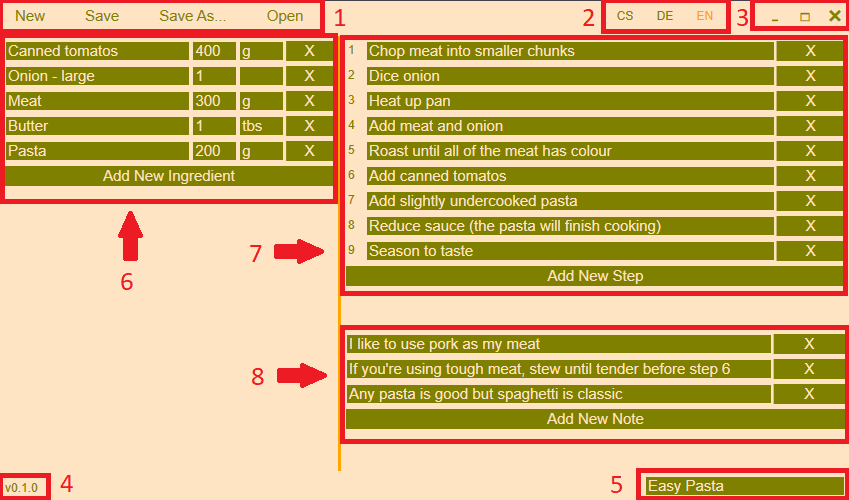

Recepter is a simple recipie writing app for Windows (and hopefully Linux).

It's like writing down recipies on paper. There's a list of ingredients, steps to follow and some notes with helpfull tips or extra info. Nothing else is needed.
Write recipies without anything in the way.

Recepters simplicity allows it to be extremely small and efficient. The .exe file is actually smaller than the two images in the installer!

1. File buttons
2. Language buttons
3. Minimize, maximize and close
4. Version nummber
5. Recipe name
6. Ingredint list
7. Step list
8. Notes

Stupidly simple, I know.  
Want the recipe? Get it <a download href="assets/downloads/Easy Pasta.xml">here.</a>
